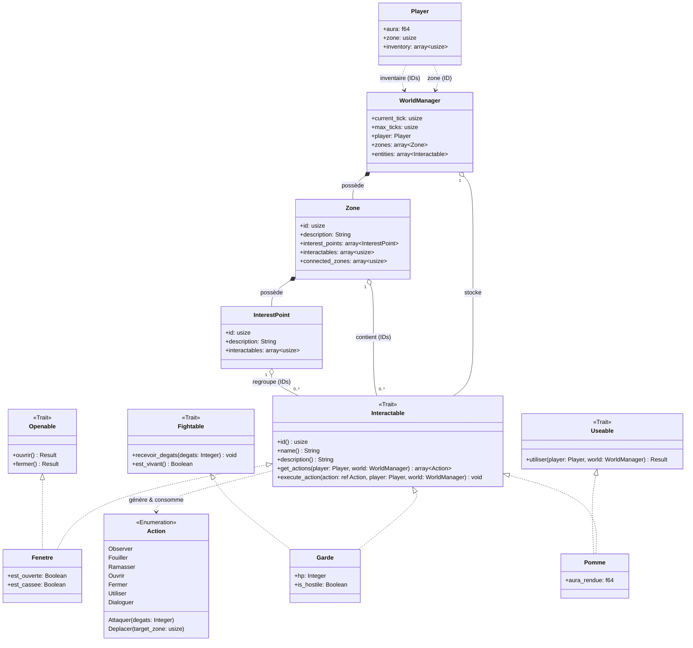

# AGENTS.md

## Status

Project in active development. Core architecture is implemented and compiles cleanly (`cargo build` passes with 0 errors, 0 warnings).

## Project

Text-based RPG simulation game for a university algorithms course (S-E06-3027). Team of up to 4 students; **evaluation is individual** — each member's contributions must be clearly traceable.

## Hard Architecture Constraint

The game engine (Rust code) **must be strictly separated** from game data (descriptions, dialogues, maps, world content).

- All game content **must live in external files** (JSON, XML, or YAML) loaded at startup via a dedicated loading function.
- The loading function reads a `"type"` field in each JSON entry to instantiate the correct concrete type.
- **No hardcoded constants or static variables** for game content inside Rust source. This is an explicit grading criterion — violating it is a significant penalty.

## CRITICAL: Diagram Conformance Rule

> **At every code-writing pass**, check the written code against the class diagram below.
> If the implementation diverges significantly (renamed entities, added/removed fields, changed relationships, new types not in the diagram), **stop and warn the user explicitly** before continuing:
>
> - Describe what diverges and why.
> - Ask whether to: (a) adjust the code to match the diagram, or (b) update the diagram to reflect the new design.
> - If the user chooses (b), update the diagram in this file **and** in `rapport_architecture.md` immediately.
>
> Never silently drift from the diagrams. They are the contract between team members.

## Source Layout

```
src/
  main.rs       # Entry point, demonstrates the Command Pattern
  actions.rs    # enum Action — all verbs the player can perform
  traits.rs     # Capability traits: Openable, Fightable, Useable
  entities.rs   # trait Interactable + concrete entity examples (Garde, Fenetre, Pomme)
  player.rs     # struct Player
  world.rs      # struct WorldManager, Zone, InterestPoint
```

## Class Diagram

> **Note:** The concrete entities shown (`Fenetre`, `Garde`, `Pomme`) and the capability traits (`Openable`, `Fightable`, `Useable`) are **illustrative examples only**. They demonstrate the architectural pattern and do not represent the exhaustive list of in-game entities.



## Key Architecture Decisions

### 1. Central storage via `WorldManager`
`WorldManager` is the sole owner of all entity instances (`Vec<Box<dyn Interactable>>`). Everything else (Player, Zone, InterestPoint) holds `usize` IDs that index into this collection. This eliminates borrow-checker cross-reference issues and `Rc<RefCell<…>>`.

### 2. Command Pattern via `enum Action`
Entities never touch I/O directly. The interaction loop works as follows:
1. Call `entity.get_actions(&player, &world)` → gets the list of available actions for the current state.
2. Display the list to the player and read their input.
3. Call `entity.execute_action(&chosen_action, &mut player, &mut world)` → the entity handles the logic.

### 3. Capability traits (Composition over Inheritance)
Specific behaviours are isolated into focused traits:
- `Openable` → `ouvrir()`, `fermer()` (doors, chests, windows…)
- `Fightable` → `recevoir_degats()`, `est_vivant()` (enemies, bosses…)
- `Useable` → `utiliser()` (consumables: food, potions…)

An entity implements `Interactable` for the game engine interface **and** any capability traits relevant to its behaviour. `execute_action` delegates to the capability trait internally (e.g. `Action::Ouvrir` → `self.ouvrir()`).

### 4. JSON loading
A dedicated loader function (to be implemented) reads world data from external JSON files. Each entity entry contains a `"type"` discriminant field that tells the loader which concrete struct to instantiate. The result is pushed into `WorldManager.entities` as a `Box<dyn Interactable>`.

## Implementation Mapping (IDs)

| Field | Rust type | Relation represented |
|---|---|---|
| `Player.zone` | `usize` | Player → Zone |
| `Player.inventory` | `Vec<usize>` | Player → 0..* entities |
| `Zone.connected_zones` | `Vec<usize>` | Zone → 0..* Zone |
| `Zone.interactables` | `Vec<usize>` | Zone → 0..* Interactable |
| `InterestPoint.interactables` | `Vec<usize>` | InterestPoint → 0..* Interactable |

## Required Rust Features (graded)

- `struct` for Player, Zone, InterestPoint, and all concrete entities
- `trait` for shared/polymorphic behaviour — `Interactable` is the core trait; `Openable`, `Fightable`, `Useable` for capabilities
- `enum` for `Action` (Command Pattern)
- Ownership, borrowing, and lifetimes used deliberately (not worked around)
- Unit tests **and** functional tests — both are mandatory

## Toolchain

- Language: Rust (Cargo)
- IDE: RustRover (`.idea/`)
- `.gitignore` includes `cargo mutants` output (`**/mutants.out*/`) — mutation testing may be used

## Commands

```
cargo build          # compile
cargo run            # run the game
cargo test           # run all tests
cargo clippy         # lint
cargo fmt            # format
```
