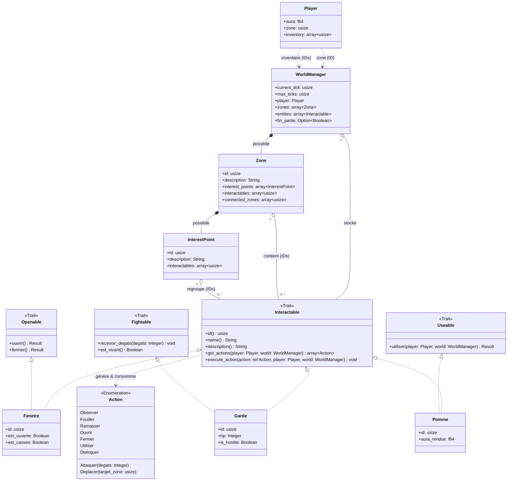

# AGENTS.md

## Status

Project in active development. Core architecture is implemented and compiles cleanly (`cargo build` passes with 0 errors, 0 warnings).

## Project

Text-based RPG simulation game for a university algorithms course (S-E06-3027). Team of up to 4 students; **evaluation is individual** — each member's contributions must be clearly traceable.

## Hard Architecture Constraint

The game engine (Rust code) **must be strictly separated** from game data (descriptions, dialogues, maps, world content).

- All game content **must live in external files** (JSON, XML, or YAML) loaded at startup via a dedicated loading function.
- The loading function reads a `"type"` field in each JSON entry to instantiate the correct concrete type.
- **No hardcoded constants or static variables** for game content inside Rust source. This is an explicit grading criterion — violating it is a significant penalty.

## CRITICAL: Diagram Conformance Rule

> **At every code-writing pass**, check the written code against the class diagram below.
> If the implementation diverges significantly (renamed entities, added/removed fields, changed relationships, new types not in the diagram), **stop and warn the user explicitly** before continuing:
>
> - Describe what diverges and why.
> - Ask whether to: (a) adjust the code to match the diagram, or (b) update the diagram to reflect the new design.
> - If the user chooses (b), update the diagram in this file **and** in `rapport_architecture.md` immediately.
>
> Never silently drift from the diagrams. They are the contract between team members.

## Source Layout

```
src/
  main.rs       # Point d'entrée + boucle de jeu (Command Pattern, navigation zones / points d'intérêt / déplacement)
  actions.rs    # enum Action — tous les verbes possibles
  traits.rs     # Traits de capacité : Openable, Fightable, Useable
  loader.rs     # Chargement du monde depuis data/world.json (DTOs serde + factory build_entity)
  menu.rs       # Menus interactifs clavier (crossterm) : select_from_menu
  couleur.rs    # Macro colore! + enum Couleur (codes ANSI)
  audio.rs      # Lecture des sons (Windows)
  save.rs       # Sauvegarde / chargement JSON de l'état (data/save.json, trait Saveable)
  player.rs     # struct Player
  world.rs      # struct WorldManager, Zone, InterestPoint + helpers
  entities/
    mod.rs      # traits Interactable + Saveable + helpers (pseudo_rand, jet_reussite) + ré-exports
    *.rs        # une entité concrète par fichier (lit, puits, chene, gargouille, barque...)
```

## Class Diagram

> **Note:** The concrete entities shown (`Fenetre`, `Garde`, `Pomme`) and the capability traits (`Openable`, `Fightable`, `Useable`) are **illustrative examples only**. They demonstrate the architectural pattern and do not represent the exhaustive list of in-game entities.



> **Note:** Toute entité concrète implémentant `Interactable` stocke un champ `id: usize` égal à son index dans `WorldManager.entities`, renseigné au chargement JSON. Ce champ permet à l'entité de se localiser elle-même (p. ex. pour le ramassage) sans dépendre d'une recherche par pointeur, même lorsque le moteur l'a temporairement swappée hors du `Vec`.

> **Note (sauvegarde) :** depuis l'ajout du système de save, `Interactable` a pour super-trait `Saveable` (méthodes `save_state()` / `load_state()`). Toute entité concrète implémente donc aussi `Saveable` (vide par défaut si elle n'a pas d'état mutable). Voir Décision #7.

## Key Architecture Decisions

### 1. Central storage via `WorldManager`
`WorldManager` is the sole owner of all entity instances (`Vec<Box<dyn Interactable>>`). Everything else (Player, Zone, InterestPoint) holds `usize` IDs that index into this collection. This eliminates borrow-checker cross-reference issues and `Rc<RefCell<…>>`.

### 2. Command Pattern via `enum Action`
Entities never touch I/O directly. The interaction loop works as follows:
1. Call `entity.get_actions(&player, &world)` → gets the list of available actions for the current state.
2. Display the list to the player and read their input.
3. Call `entity.execute_action(&chosen_action, &mut player, &mut world)` → the entity handles the logic.

### 3. Capability traits (Composition over Inheritance)
Specific behaviours are isolated into focused traits:
- `Openable` → `ouvrir()`, `fermer()` (doors, chests, windows…)
- `Fightable` → `recevoir_degats()`, `est_vivant()` (enemies, bosses…)
- `Useable` → `utiliser()` (consumables: food, potions…)

An entity implements `Interactable` for the game engine interface **and** any capability traits relevant to its behaviour. `execute_action` delegates to the capability trait internally (e.g. `Action::Ouvrir` → `self.ouvrir()`).

### 4. JSON loading
La fonction de chargement (`loader::load_from_json`, ou `load_from_str` pour les tests) lit le monde depuis `data/world.json`. Chaque entrée d'entité contient un champ discriminant `"type"` qui indique au loader quel struct concret instancier (factory `build_entity`). Le résultat est poussé dans `WorldManager.entities` sous forme de `Box<dyn Interactable>`. Toutes les références (zones, entités) sont des IDs **texte** dans le JSON, résolus en `usize` au chargement.

### 5. Plusieurs actions sous un même verbe → sous-menu interne
Le moteur identifie une interaction par le couple **(entité, verbe `Action`)** ; ce couple doit rester unique. Quand une entité a besoin de plusieurs variantes du même verbe (ex. un PNJ avec 3 « Dialoguer »), elle n'expose **qu'un seul** verbe dans `get_actions`, puis ouvre un **sous-menu** dans son `execute_action` via `menu::select_from_menu`. Cela évite de modifier l'enum `Action` (et donc le diagramme). **Contrepartie assumée :** l'entité dépend alors de l'UI pour lire le sous-choix (cf. rapport_architecture.md §9).

### 6. Ajouter une nouvelle entité (recette)
1. Créer `src/entities/<nom>.rs` : une `struct` + `impl Interactable` + **`impl Saveable`** (obligatoire — vide si pas d'état mutable) + les traits de capacité utiles (`Useable`/`Openable`/`Fightable`).
2. La déclarer dans `src/entities/mod.rs` (`pub mod` + `pub use`).
3. Dans `loader.rs` : ajouter une variante à `enum EntityDto`, un bras à `EntityDto::id()`, et un bras à la factory `build_entity` (en y initialisant les bools d'état à `false`).
4. Décrire l'entité dans `data/world.json` avec son champ `"type"`.
5. Pour un simple objet ramassable (clé, corde, pièce…), réutiliser le type générique **`Objet`** plutôt que de créer un nouveau type.
6. Si une action donne de l'aura **positive et répétable**, la plafonner avec un bool d'état (cf. Décision #9).

### 7. Persistance et sauvegarde (`Saveable`)
Le trait `Saveable` (super-trait de `Interactable`) expose `save_state()` / `load_state()` — une map `String → JSON`. `save.rs` sérialise dans `data/save.json` l'état mutable de chaque entité (bools), plus le joueur et les listes d'entités des zones. Une entité **sans** état mutable utilise l'implémentation par défaut (vide) ; une entité **avec** état sérialise ses bools (ex. `Puits` → `deja_crie`, `Barque` → `reparee`, `Coffre` → `est_ouverte`).

### 8. Navigation entre zones (« Se déplacer »)
La boucle de jeu propose une entrée **« Se déplacer »** dès qu'une zone possède des `connected_zones` : elle liste les zones reliées et y déplace le joueur (≈ 15 min de marche). C'est le **seul** usage de `Zone.connected_zones` (avant, ce champ était chargé mais inutilisé). Les transitions **verrouillées/conditionnelles** (porte, fenêtre, barque) restent gérées par l'entité elle-même via `Action::Deplacer` (la zone-cible est stockée dans l'entité, résolue au chargement). Conséquence : une zone sans `connected_zones` (ex. la **maison**) ne se quitte que par ses entités-sorties.

### 9. Pas d'aura infinie (gating)
L'aura est l'enjeu central du jeu : toute source d'aura **positive et répétable** doit être plafonnée, sinon elle se farme à l'infini. Deux techniques utilisées : **(a)** gain ponctuel gardé par un bool d'état (`deja_*`, `*_donne`, `*_pris`, `*_trouve`…) passé à `true` au premier gain ; **(b)** pari à espérance ≤ 0 (ex. puits « descendre » 30 %, meule « soulever » 2 %). Les **pertes** répétables sont autorisées (ce sont des pièges assumés). _(Origine : retour du scrum master sur le puits, dont l'espérance de gain était positive.)_

> **Note de flux de jeu :** **le jeu est complet.** Zones navigables : **Maison → Plaine → Forêt → Cimetière**, **Plaine / Forêt → Lac → Île**, **Plaine / Lac → Village → Château → Salle du trône**. La fin se joue dans la Salle du trône : l'évaluation du Roi (victoire si aura ≥ 1 000 000, sinon 20 % de chance) clôt la partie via `WorldManager.fin_partie`. La maison se quitte par la porte (clé / enfoncer) ou la fenêtre — pas par « Se déplacer ».

## Contenu du monde (implémenté)

> `histoire.md` = spécification complète du jeu. Ce tableau dit ce qui est **réellement codé** à ce jour.

| Zone | Entités directes | Points d'intérêt (entités) |
|---|---|---|
| `zone_maison` | Lit, Marmite, CleMaison, Balai, Fenetre, Porte | — |
| `zone_plaine` | Puits, Epouvantail | Moulin (Meunier, Meule, SacsFarine) · Maison Michu (PorteMichu, Michu, Chat) |
| `zone_foret` | Panneau, Champignon | Vieux Chêne (Chene, Ermite) · Clairière (Souche, Renard) |
| `zone_cimetiere` | Tombe, Fossoyeur | Mausolée (Gargouille, Esprit) |
| `zone_lac` | Lac, Barque | Ponton (Canne, Seau) |
| `zone_ile` | Coffre, ArbreTordu | — |
| `zone_village` | Poules, Fontaine, Marchand | Taverne (Tavernier, Barde, Tonneau) · Forge (Forgeron, Enclume) |
| `zone_chateau` | Gardes, PontLevis | — |
| `zone_salle_trone` | Roi | — |

**Choix de conception spécifiques au contenu :**
- **Île = zone à part entière** (`zone_ile`), pas un point d'intérêt : on y accède via la **barque** (`Action::Deplacer`), ce qui permet de gérer le verrou « barque réparée » comme la porte gère son `Deplacer`. Le retour se fait par « Se déplacer ».
- **Sortie de la maison** : la maison n'a **pas** de `connected_zones` (fidèle à `histoire.md`) → on sort par la porte ou la fenêtre, jamais par « Se déplacer ».
- **Corde partagée, non consommée** : réparer la barque **et** la canne nécessite la corde du puits ; aucune des deux réparations ne la consomme (il n'existe qu'une corde → sinon soft-lock).
- **`balai_maison` vs `balai_depart`** : `histoire.md` nomme le balai `balai_depart`, mais son id réel dans le JSON est `balai_maison`. La gargouille (cassable avec le balai ou un `bidule_metal`) est branchée sur l'id réel.
- **Objets créés en avance** : certains objets sont définis avant la zone qui les produit/consomme (ex. objets de la Forêt utilisés plus tard au Lac/Village) afin que les références JSON résolvent au chargement. Ils sont simplement inaccessibles tant que leur zone d'origine n'existe pas. _Cas résolu :_ `bidule_metal`, créé en avance pour la gargouille du Cimetière, est désormais **réellement produit par la forge du Village** (enclume) — la boucle est fermée.
- **Bools d'état** (état runtime, **non** dans le diagramme — comme `chapeau_pris` — initialisés à `false` dans `build_entity`, sérialisés via `Saveable`) : `deja_crie`, `deja_attaque`, `travail_donne`, `deja_grimpe`/`deja_enlace`/`deja_grave`, `conseil_donne`, `epee_prise`, `deja_assis`, `baie_donnee`, `ver_trouve`, `deja_insulte`, `gargouille_brisee`, `duel_gagne`, `deja_baigne`, `deja_bu`, `reparee`, `est_ouverte`, `poisson_pris`, `botte_prise`, `deja_caresse`, `deja_lave`, `chanson_faite`, `deja_cache`, `bidule_pris`.
- **Accès au château (laissez-passer)** : les gardes accordent l'accès (montrer la cape/l'armure, corrompre avec pièce/rubis, ou forcer à 10 %) en ajoutant l'objet `laissez_passer` à l'inventaire ; le pont-levis ne mène à la salle du trône **que** si on le possède. C'est le pattern « jeton d'accès en inventaire », faute d'état partagé entre entités.
- **Fin de partie** : le Roi écrit `WorldManager.fin_partie = Some(true/false)` lors de l'évaluation finale ; la boucle de jeu lit ce champ et clôt la partie (victoire / défaite). _(Champ ajouté au `WorldManager` → diagramme mis à jour en conséquence.)_

> **Limitation connue (moteur) :** il n'existe **pas** de menu « utiliser un objet depuis l'inventaire ». Un objet n'agit que lorsqu'une entité teste `player.inventory.contains(...)` (échanges, déverrouillages, réparations). **Contournement adopté pour les consommables « actifs » :** on applique l'effet **au moment de l'acquisition** plutôt que via un usage différé — ex. le philtre du marchand est **bu directement à l'achat** (malus immédiat), au lieu de rester une fiole inutilisable dans l'inventaire.

## Implementation Mapping (IDs)

| Field | Rust type | Relation represented |
|---|---|---|
| `Player.zone` | `usize` | Player → Zone |
| `Player.inventory` | `Vec<usize>` | Player → 0..* entities |
| `Zone.connected_zones` | `Vec<usize>` | Zone → 0..* Zone |
| `Zone.interactables` | `Vec<usize>` | Zone → 0..* Interactable |
| `InterestPoint.interactables` | `Vec<usize>` | InterestPoint → 0..* Interactable |

## Required Rust Features (graded)

- `struct` for Player, Zone, InterestPoint, and all concrete entities
- `trait` for shared/polymorphic behaviour — `Interactable` is the core trait; `Openable`, `Fightable`, `Useable` for capabilities
- `enum` for `Action` (Command Pattern)
- Ownership, borrowing, and lifetimes used deliberately (not worked around)
- Unit tests **and** functional tests — both are mandatory

## Toolchain

- Language: Rust (Cargo)
- IDE: RustRover (`.idea/`)
- `.gitignore` includes `cargo mutants` output (`**/mutants.out*/`) — mutation testing may be used

## Commands

```
cargo build          # compile
cargo run            # run the game
cargo test           # run all tests
cargo clippy         # lint
cargo fmt            # format
```
