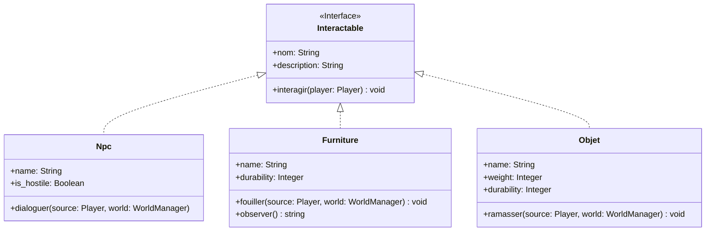
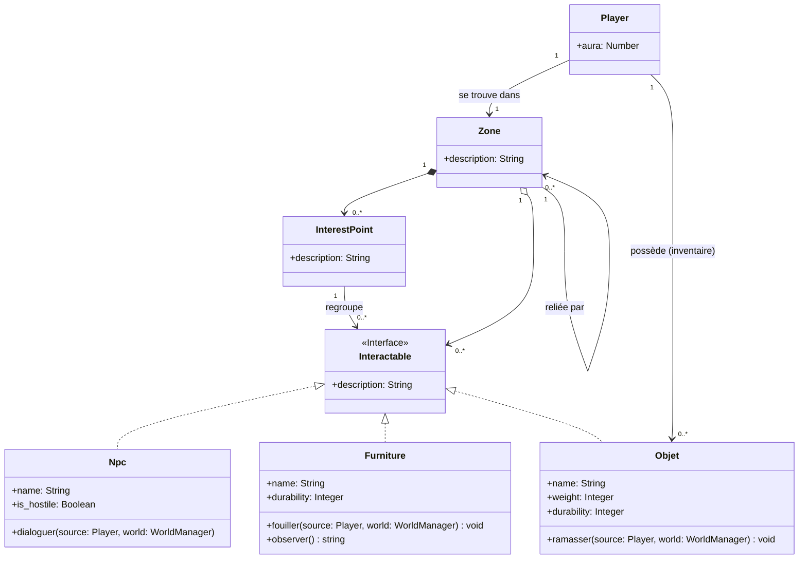

# AGENTS.md

## Status

Early-stage Rust project. No source code exists yet (`Cargo.toml` and `src/` are absent).

## Project

Text-based RPG simulation game for a university algorithms course (S-E06-3027). Team of up to 4 students; **evaluation is individual** — each member's contributions must be clearly traceable.

## Hard Architecture Constraint

The game engine (Rust code) **must be strictly separated** from game data (descriptions, dialogues, maps, world content).

- All game content **must live in external files** (XML, JSON, or YAML) loaded at startup.
- **No hardcoded constants or static variables** for game content inside Rust source. This is an explicit grading criterion — violating it is a significant penalty.

## CRITICAL: Diagram Conformance Rule

> **At every code-writing pass**, check the written code against the class diagram and ER diagram below.
> If the implementation diverges significantly (renamed entities, added/removed fields, changed relationships, new types not in the diagrams), **stop and warn the user explicitly** before continuing:
>
> - Describe what diverges and why.
> - Ask whether to: (a) adjust the code to match the diagrams, or (b) update the diagrams to reflect the new design.
> - If the user chooses (b), update the diagrams in this file immediately and commit the change.
>
> Never silently drift from the diagrams. They are the contract between team members.

## Class Diagram



## ER Diagram



## Required Rust Features (graded)

- `struct` for characters, enemies, items, zones
- `trait` for shared/polymorphic behaviour across entities — `Interactable` is the core trait
- Ownership, borrowing, and lifetimes used deliberately (not worked around)
- Unit tests **and** functional tests — both are mandatory

## Game Mechanics to Implement

- Character creation with configurable attributes (Player has `aura` stat)
- World exploration across distinct `Zone`s linked to each other
- `InterestPoint`s within zones group `Interactable` entities
- Interaction system: NPCs (`dialoguer`), Furniture (`fouiller`, `observer`), Objects (`ramasser`)
- Simulation: the world must be able to evolve autonomously (physics/logic rules)

## Toolchain

- Language: Rust (Cargo)
- IDE: RustRover (`.idea/`)
- `.gitignore` includes `cargo mutants` output (`**/mutants.out*/`) — mutation testing may be used

## Commands (once `Cargo.toml` exists)

```
cargo build          # compile
cargo test           # run all tests
cargo clippy         # lint
cargo fmt            # format
cargo mutants        # mutation testing (if used)
```

## Notes

- Update this file once crate layout is decided (binary vs library, workspace vs single crate).
- If diagrams are updated, keep both the Class Diagram and ER Diagram sections in sync — they share the same entity set.
