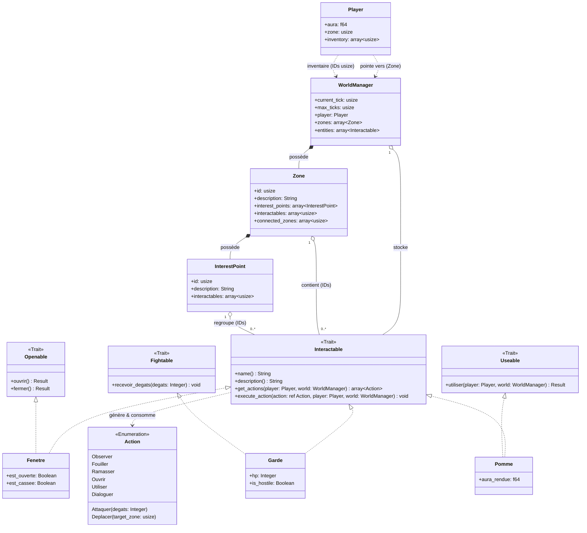

# Rapport d'Architecture : Conception d'un Jeu de Rôle Textuel "Aura Farming Simulator"

Ce rapport présente l'architecture logicielle finale retenue pour notre jeu de rôle textuel. Conçu en Rust, le système tire pleinement parti de la philosophie du langage (sécurité de la mémoire, typage fort, composition par traits) tout en respectant scrupuleusement les contraintes du projet : un monde autonome, simulé logiquement, et facilement sérialisable (XML/JSON/YAML). L'architecture s'articule autour de trois piliers fondamentaux : un stockage centralisé, un système de commandes découplé, et une modularité par traits de capacité.

---

## 1. Le Modèle de Stockage Centralisé (WorldManager et IDs)

Au cœur de l'architecture se trouve le `WorldManager`. En Rust, les règles strictes de possession (Ownership) et d'emprunt (Borrowing) rendent la manipulation de graphes d'objets (comme un personnage tenant un objet, lui-même présent dans une zone) très complexe. 

Pour pallier ce problème, l'architecture opte pour un modèle relationnel robuste :
- **Source unique de vérité :** Le `WorldManager` est l'unique propriétaire des instances physiques du jeu, stockées dans des listes plates (`zones: array<Zone>`, `entities: array<Interactable>`). Le chargement depuis un fichier JSON est géré par une fonction dédiée qui lit un champ `"type"` dans chaque entrée et instancie le bon type concret.
- **Références par IDs (`usize`) :** Le joueur, les zones et les points d'intérêt ne possèdent pas d'objets concrets, mais uniquement des nombres (`usize`) agissant comme des pointeurs logiques. 
- **Bénéfices :** Ce choix garantit l'absence de cycles de références, élimine le besoin de pointeurs intelligents lourds (ex: `Rc<RefCell>`), et rend la sauvegarde/chargement de l'état du jeu trivial via des bibliothèques de sérialisation comme `serde`.

## 2. La Hiérarchie Spatiale et Logique (Zone et InterestPoint)

Le monde physique est structuré de manière hiérarchique, reflétant parfaitement les contraintes d'appartenance de la simulation :
- **La Composition (`*--`) :** Les points d'intérêt (`InterestPoint`) font physiquement partie d'une `Zone`. Leur existence est intrinsèquement liée à la zone qui les englobe.
- **L'Agrégation (`o--`) :** Les entités interactives (`Interactable`), en revanche, sont liées aux zones par simple agrégation. Cela modélise avec précision la notion de "mobilité". Un PNJ ou une épée peut se déplacer d'un point à un autre par un simple transfert d'ID entre deux vecteurs, sans nécessiter de réallocation mémoire complexe.

## 3. Le Moteur d'Interaction Dynamique (Command Pattern)

L'interaction entre le joueur et le monde repose sur le motif de conception "Commande", implémenté via la puissante énumération Rust `Action`.

- **L'Enumération `Action` :** Plutôt que de multiplier les classes abstraites et l'allocation dynamique, Rust permet de regrouper les actions dans un type compact, capable de transporter de la donnée (ex: `Attaquer(degats: Integer)` ou `Deplacer(target_zone: usize)`).
- **Découplage UI / Logique :** Les entités n'ont aucune dépendance aux entrées/sorties (console/clavier). L'entité déclare ses capacités via `get_actions()`. Le moteur de jeu se charge de les afficher et d'interpréter le choix du joueur, avant de déclencher `execute_action()`. 
- **Bénéfices :** Ce découplage total garantit un code hautement testable unitairement et simplifie considérablement une potentielle transition vers une interface graphique future.

## 4. Modularité par les Traits de Capacité (Composition > Héritage)

S'éloignant du modèle classique de l'héritage orienté objet, l'architecture embrasse la composition par traits, fondation du design Rust.

- **Les Traits Spécialisés :** Des comportements précis et standardisés sont isolés dans des traits comme `Openable` (Ouvrable), `Fightable` (Combattable) ou `Useable` (Utilisable).
- **Polymorphisme Idiomatique :** Une entité concrète comme `Fenetre` implémente `Interactable` (pour le dialogue avec le moteur) et `Openable` (pour sa logique interne de verrouillage). Lorsqu'elle reçoit l'action `Ouvrir`, elle délègue le traitement à sa propre méthode `ouvrir()` définie par le trait.
- **Bénéfices :** Ce modèle impose un contrat strict de développement (toutes les portes s'ouvriront de la même manière dans le code) et favorise l'émergence d'entités hybrides (ex: Un "Coffre-Piège" à la fois `Openable` et `Fightable`).

## 5. L'Inventaire par Identifiants

L'inventaire du joueur (`inventory: Vec<usize>`) est une liste d'identifiants pointant vers des entités stockées dans `WorldManager.entities`. Ce mécanisme garantit qu'il n'existe qu'une seule instance de chaque entité en mémoire, quel que soit le nombre d'entités qui y font référence (zone, point d'intérêt, inventaire du joueur). Déplacer un objet de l'environnement vers l'inventaire revient simplement à retirer son ID d'un vecteur et à l'ajouter à un autre, sans aucune réallocation mémoire.

---

## 6. Diagramme d'Architecture UML

> [!NOTE]
> **Avertissement :** Les entités (`Fenetre`, `Garde`, `Pomme`) ainsi que les actions et traits de capacités (`Openable`, `Useable`, etc.) présentés dans ce diagramme et dans les extraits de code suivants ne sont que des **exemples illustratifs**. Ils démontrent la logique de l'architecture mais ne visent pas à représenter l'exhaustivité des objets et actions du jeu final.



## 7. Exemples d'Implémentation en Rust

Voici quelques extraits de code illustrant la mise en pratique de cette architecture.

### L'Enumération Action
```rust
pub enum Action {
    Observer,
    Ouvrir,
    Fermer,
    Utiliser,
    Attaquer { degats: i32 },
}
```

### Le Trait de Capacité (Composition)
```rust
pub trait Openable {
    fn ouvrir(&mut self) -> Result<(), &'static str>;
    fn fermer(&mut self) -> Result<(), &'static str>;
}
```

### L'Implémentation d'une Entité (Exemple : La Fenêtre)
```rust
pub struct Fenetre {
    pub name: String,
    pub description: String,
    pub est_ouverte: bool,
    pub est_cassee: bool,
}

// 1. Implémentation de sa capacité propre
impl Openable for Fenetre {
    fn ouvrir(&mut self) -> Result<(), &'static str> {
        if self.est_cassee { return Err("Impossible, la fenêtre est cassée !"); }
        if self.est_ouverte { return Err("C'est déjà ouvert."); }
        self.est_ouverte = true;
        Ok(())
    }
    fn fermer(&mut self) -> Result<(), &'static str> {
        self.est_ouverte = false;
        Ok(())
    }
}

// 2. Implémentation du trait générique pour le moteur de jeu
impl Interactable for Fenetre {
    fn name(&self) -> &str { &self.name }
    fn description(&self) -> &str { &self.description }

    fn get_actions(&self, _player: &Player, _world: &WorldManager) -> Vec<Action> {
        let mut actions = vec![Action::Observer];
        if !self.est_cassee {
            if self.est_ouverte { actions.push(Action::Fermer); }
            else { actions.push(Action::Ouvrir); }
        }
        actions
    }

    fn execute_action(&mut self, action: &Action, _player: &mut Player, _world: &mut WorldManager) {
        match action {
            Action::Observer => println!("Vous regardez la fenêtre."),
            Action::Ouvrir => match self.ouvrir() {
                Ok(_) => println!("Vous avez ouvert la fenêtre."),
                Err(e) => println!("{}", e),
            },
            Action::Fermer => match self.fermer() {
                Ok(_) => println!("Vous avez fermé la fenêtre."),
                Err(e) => println!("{}", e),
            },
            _ => println!("Action impossible ici."),
        }
    }
}
```


---

## 8. Conclusion

Cette architecture répond intégralement aux exigences du cahier des charges. L'association d'un gestionnaire central par identifiants (`WorldManager` + `usize`) et d'un système d'événements découplés (Enum `Action`) confère au jeu des performances optimales et une sécurité mémoire garantie par le compilateur. La modélisation par traits de capacité offre une souplesse exceptionnelle, favorisant un gameplay riche et extensible. L'équipe dispose ainsi d'une fondation idiomatique en Rust, saine, maintenable et prête pour la phase de production.
